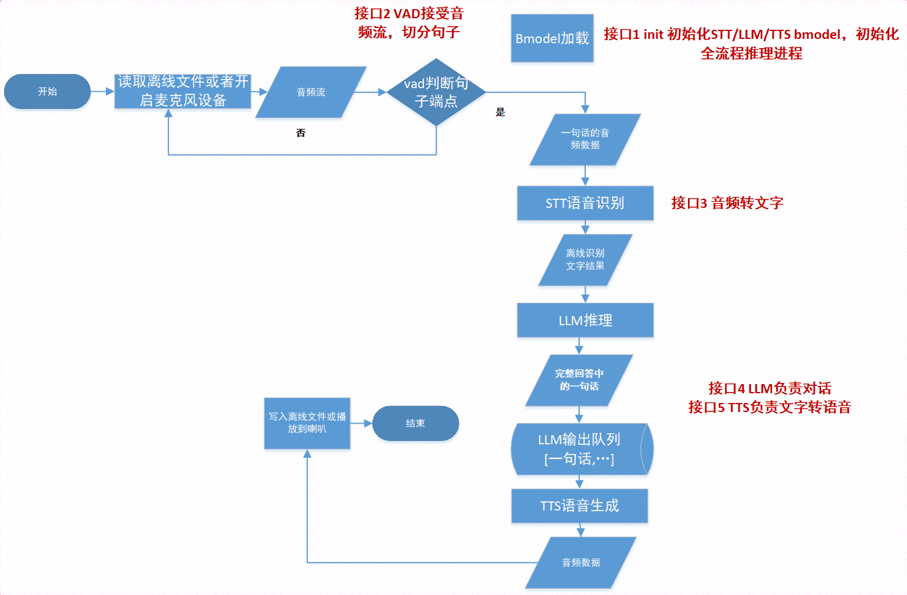

# Python例程 <!-- omit in toc -->

## 目录 <!-- omit in toc -->
- [1. 环境准备](#1-环境准备)
  - [1.1 x86/arm PCIe平台](#11-x86arm-pcie平台)
  - [1.2 SoC平台](#12-soc平台)
- [2. 准备模型与数据](#2-准备模型与数据)
- [3. 推理测试](#3-推理测试)
  - [3.1 参数说明](#31-参数说明)
  - [3.2 使用方式](#32-使用方式)
- [4. 程序运行性能](#4-程序运行性能)
- [5. 流程图](#5-流程图)

python目录下提供了Python例程，具体情况如下：

| 序号  |             Python例程                    |             说明                |
| ---- | ----------------------------------------  | ------------------------------- |
| 1    |    whisper_minicpm_llama3_vits.py         |         使用SAIL和BMRT推理       |


## 1. 环境准备
### 1.1 x86/arm PCIe平台

如果您在x86/arm平台安装了PCIe加速卡（如SC系列加速卡），并使用它测试本例程，您需要安装libsophon、sophon-opencv、sophon-ffmpeg和sophon-sail，具体请参考[x86-pcie平台的开发和运行环境搭建](../../../docs/Environment_Install_Guide.md#3-x86-pcie平台的开发和运行环境搭建)或[arm-pcie平台的开发和运行环境搭建](../../../docs/Environment_Install_Guide.md#5-arm-pcie平台的开发和运行环境搭建)。

- Python >= 3.8.2环境，SDK >= v23.09。

- 如果您使用Llama3作为LLM，则需要执行如下步骤进行编译
```bash
sudo apt-get install pybind11-dev
# 编译库文件
cd Llama3/python_demo
python3 -m dfss --url=open@sophgo.com:sophon-demo/application/Audio_assistant/llama3/support.zip
unzip support.zip -d ../
rm -f support.zip
mkdir build
cd build && cmake -DTARGET_ARCH=pcie .. && make && mv *cpython* ../..
cd ../../..
```

- 接着需要下载Whisper的依赖文件
```bash
cd whisper-TPU_py/bmwhisper
python3 -m dfss --url=open@sophgo.com:sophon-demo/application/Audio_assistant/whisper-TPU_py/third_party.zip
unzip third_party.zip -d ./
rm -f third_party.zip
python3 -m dfss --url=open@sophgo.com:sophon-demo/application/Audio_assistant/whisper-TPU_py/assets.zip
unzip assets.zip -d ./
rm -f assets.zip
cd ../..
```

- 此外您还需要安装其他python第三方库：
```bash
sudo apt install portaudio19-dev
sudo apt-get install libsndfile1
pip3 install torch==2.2.2 torchvision==0.17.2 torchaudio==2.2.2 --index-url https://download.pytorch.org/whl/cpu
pip3 install -r requirements.txt
```

### 1.2 SoC平台

如果您使用SoC平台（如SE、SM系列边缘设备），并使用它测试本例程，刷机后在`/opt/sophon/`下已经预装了相应的libsophon、sophon-opencv和sophon-ffmpeg运行库包。

- SDK >= v23.09

- 如果您使用Llama3作为LLM，则需要在SOC平台执行如下步骤进行编译
```bash
sudo apt-get install pybind11-dev
# 编译库文件
cd Llama3/python_demo
python3 -m dfss --url=open@sophgo.com:sophon-demo/application/Audio_assistant/llama3/support.zip
unzip support.zip -d ../
rm -f support.zip
mkdir build
cd build && cmake -DTARGET_ARCH=soc .. && make && mv *cpython* ../..
cd ../../..
```

- 如果您使用MiniCPM作为LLM，则需要在SOC平台执行如下步骤进行编译
```bash
# 编译库文件
cd MiniCPM/demo
python3 -m dfss --url=open@sophgo.com:sophon-demo/application/Audio_assistant/minicpm/support.zip
unzip support.zip -d ../
rm -f support.zip
mkdir build
cd build && cmake -DTARGET_ARCH=soc .. && make && mv minicpm ..
cd ../../..
```

- 接着需要下载Whisper的依赖文件
```bash
cd whisper-TPU_py/bmwhisper
python3 -m dfss --url=open@sophgo.com:sophon-demo/application/Audio_assistant/whisper-TPU_py/third_party.zip
unzip third_party.zip -d ./
rm -f third_party.zip
python3 -m dfss --url=open@sophgo.com:sophon-demo/application/Audio_assistant/whisper-TPU_py/assets.zip
unzip assets.zip -d ./
rm -f assets.zip
cd ../..
```

- 此外您还需要在SOC平台安装其他python第三方库：
```bash
pip3 install dfss -i https://pypi.tuna.tsinghua.edu.cn/simple --upgrade
# 对于SE9平台
python3 -m dfss --url=open@sophgo.com:sophon-demo/application/Audio_assistant/sophon_arm-3.8.0-py3-none-any.whl
pip3 install sophon_arm-3.8.0-py3-none-any.whl --force-reinstall
rm -f sophon_arm-3.8.0-py3-none-any.whl
# 对于SE7平台
python3 -m dfss --url=open@sophgo.com:sophon-demo/application/Audio_assistant/84x_soc_sail/sophon-3.8.0-py3-none-any.whl
pip3 install sophon-3.8.0-py3-none-any.whl --force-reinstall
rm -f sophon-3.8.0-py3-none-any.whl
# 对于SE7、SE9平台
sudo apt install portaudio19-dev
sudo apt-get install libsndfile1
pip3 install networkx==2.8.8
pip3 install torch==2.2.2 torchvision==0.17.2 torchaudio==2.2.2 --index-url https://download.pytorch.org/whl/cpu
pip3 install requests==2.26.0
pip3 install -r requirements.txt
```

- 对于SE9平台，运行前需要下载额外动态库，然后设置环境变量
```bash
python3 -m dfss --url=open@sophgo.com:sophon-demo/application/Audio_assistant/libfirmware_core.so
export BMRUNTIME_USING_FIRMWARE=/path-to-current-dir/libfirmware_core.so
```

## 2. 准备模型与数据
该例程目前只支持在BM1684X和BM1688上运行，已提供编译好的bmodel和测试数据，​同时，您也可以自行准备用于测试的数据集。

​本例程在`scripts`目录下提供了相关模型和数据的下载脚本
```bash
└── scripts
    ├── download_bm1684x_whisper_llama3_vits.sh                              # 通过该脚本下载BM1684X平台运行所需要的BModel
    ├── download_bm1688_whisper_minicpm_vits.sh                              # 通过该脚本下载BM1688平台运行所需要的BModel
    ├── download_datasets.sh                                                 # 通过该脚本下载测试音频文件
    └── download.sh                                                          # 通过该脚本下载所有模型和测试数据
```

- 对于BM1688平台，执行如下命令下载模型
```bash
# 安装unzip，若已安装请跳过
sudo apt install unzip
cd ..
chmod -R +x scripts/
./scripts/download_bm1688_whisper_minicpm_vits.sh
cd python
```

下载的模型包括：
```
./models
└── BM1688
    ├── minicpm
    |   ├── minicpm-2b_int4_1core.bmodel                                                                 # MiniCPM-2B int4，1core BM1688 BModel
    |   └── tokenizer.model                                                                              # MiniCPM-2B 的Tokenizer模型
    ├── vits
    |   ├── bert_1688_f32_1core.bmodel                                                                   # VITS BERT fp32，1core BM1688 BModel
    |   └── vits_chinese_128_bm1688_f16_1core.bmodel                                                     # VITS fp16，1core BM1688 BModel
    └── whisper
        ├── all_quant_decoder_loop_with_kvcache_and_rearrange_base_5beam_128pad_bm1688_f16.bmodel        # Whisper-Base Decoder模型，beam size为5，输出最大token长度为128，fp16 BM1688 BModel
        ├── all_quant_decoder_loop_with_kvcache_and_rearrange_small_5beam_128pad_bm1688_f16.bmodel       # Whisper-Small Decoder模型，beam size为5，输出最大token长度为128，fp16 BM1688 BModel
        ├── all_quant_decoder_loop_with_kvcache_and_rearrange_small_5beam_448pad_bm1688_f16.bmodel       # Whisper-Small Decoder模型，beam size为5，输出最大token长度为448，效率相比128模型更低，fp16 BM1688 BModel
        ├── all_quant_decoder_main_with_kvcache_base_5beam_128pad_bm1688_f16.bmodel                      # Whisper-Base Decoder模型，beam size为5，输出最大token长度为128，fp16 BM1688 BModel
        ├── all_quant_decoder_main_with_kvcache_small_5beam_128pad_bm1688_f16.bmodel                     # Whisper-Small Decoder模型，beam size为5，输出最大token长度为128，fp16 BM1688 BModel
        ├── all_quant_decoder_main_with_kvcache_small_5beam_448pad_bm1688_f16.bmodel                     # Whisper-Small Decoder模型，beam size为5，输出最大token长度为448，效率相比128模型更低，fp16 BM1688 BModel
        ├── all_quant_decoder_post_base_5beam_128pad_bm1688_f16.bmodel                                   # Whisper-Base Decoder模型，beam size为5，fp16 BM1688 BModel
        ├── all_quant_decoder_post_small_5beam_128pad_bm1688_f16.bmodel                                  # Whisper-Small Decoder模型，beam size为5，fp16 BM1688 BModel
        ├── all_quant_decoder_post_small_5beam_448pad_bm1688_f16.bmodel                                  # Whisper-Small Decoder模型，beam size为5，fp16 BM1688 BModel
        ├── all_quant_encoder_base_5beam_128pad_bm1688_f16.bmodel                                        # Whisper-Base Encoder模型，beam size为5，fp16 BM1688 BModel
        ├── all_quant_encoder_small_5beam_128pad_bm1688_f16.bmodel                                       # Whisper-Small Encoder模型，beam size为5，fp16 BM1688 BModel
        ├── all_quant_encoder_small_5beam_448pad_bm1688_f16.bmodel                                       # Whisper-Small Encoder模型，beam size为5，fp16 BM1688 BModel
        ├── all_quant_logits_decoder_base_5beam_128pad_bm1688_f16.bmodel                                 # Whisper-Base 预测层，beam size为5，fp16 BM1688 BModel
        ├── all_quant_logits_decoder_small_5beam_128pad_bm1688_f16.bmodel                                # Whisper-Small 预测层，beam size为5，fp16 BM1688 BModel
        └── all_quant_logits_decoder_small_5beam_448pad_bm1688_f16.bmodel                                # Whisper-Small 预测层，beam size为5，fp16 BM1688 BModel
```

- 对于BM1684X平台，执行如下命令下载模型
```bash
# 安装unzip，若已安装请跳过
sudo apt install unzip
cd ..
chmod -R +x scripts/
./scripts/download_bm1684x_whisper_llama3_vits.sh
cd python
```

下载的模型包括：
```
./models
└── BM1684X
    ├── llama3
    |   ├── token_config                                                                                 # Llama3-8B Tokenizer配置文件 
    |   └── llama3-8b_int4_1dev_256.bmodel                                                               # Llama3-8B 最大输出长度为256个tokens，int4 Bmodel
    ├── vits
    |   ├── bert_1684x_f32.bmodel                                                                        # VITS BERT fp32 BModel
    |   └── vits_chinese_128_f16.bmodel                                                                  # VITS fp16 BModel
    └── whisper
        ├── all_quant_decoder_loop_with_kvcache_and_rearrange_base_5beam_448pad_1684x_f16.bmodel         # Whisper-Base Decoder模型，beam size为5，输出最大token长度为448，fp16 BM1684X BModel
        ├── all_quant_decoder_loop_with_kvcache_and_rearrange_large-v2_5beam_448pad_1684x_f16.bmodel     # Whisper-Large-v2 Decoder模型，beam size为5，输出最大token长度为448，fp16 BM1684X BModel
        ├── all_quant_decoder_loop_with_kvcache_and_rearrange_large-v3_5beam_448pad_1684x_f16.bmodel     # Whisper-Large-v3 Decoder模型，beam size为5，输出最大token长度为448，fp16 BM1684X BModel
        ├── all_quant_decoder_loop_with_kvcache_and_rearrange_medium_5beam_448pad_1684x_f16.bmodel       # Whisper-Medium Decoder模型，beam size为5，输出最大token长度为448，fp16 BM1684X BModel
        ├── all_quant_decoder_loop_with_kvcache_and_rearrange_small_5beam_448pad_1684x_f16.bmodel        # Whisper-Small Decoder模型，beam size为5，输出最大token长度为448，fp16 BM1684X BModel
        ├── all_quant_decoder_main_with_kvcache_base_5beam_448pad_1684x_f16.bmodel                       # Whisper-Base Decoder模型，beam size为5，输出最大token长度为448，fp16 BM1684X BModel
        ├── all_quant_decoder_main_with_kvcache_medium_5beam_448pad_1684x_f16.bmodel                     # Whisper-Medium Decoder模型，beam size为5，输出最大token长度为448，fp16 BM1684X BModel
        ├── all_quant_decoder_main_with_kvcache_small_5beam_448pad_1684x_f16.bmodel                      # Whisper-Small Decoder模型，beam size为5，输出最大token长度为448，fp16 BM1684X BModel
        ├── all_quant_decoder_post_base_5beam_448pad_1684x_f16.bmodel                                    # Whisper-Base Decoder模型，beam size为5，fp16 BM1684X BModel
        ├── all_quant_decoder_post_medium_5beam_448pad_1684x_f16.bmodel                                  # Whisper-Medium Decoder模型，beam size为5，fp16 BM1684X BModel
        ├── all_quant_decoder_post_small_5beam_448pad_1684x_f16.bmodel                                   # Whisper-Small Decoder模型，beam size为5，fp16 BM1684X BModel
        ├── all_quant_encoder_base_5beam_448pad_1684x_f16.bmodel                                         # Whisper-Base Encoder模型，beam size为5，fp16 BM1684X BModel
        ├── all_quant_encoder_medium_5beam_448pad_1684x_f16.bmodel                                       # Whisper-Medium Encoder模型，beam size为5，fp16 BM1688 BModel
        ├── all_quant_encoder_small_5beam_448pad_1684x_f16.bmodel                                        # Whisper-Small Encoder模型，beam size为5，fp16 BM1684X BModel
        ├── all_quant_logits_decoder_base_5beam_448pad_1684x_f16.bmodel                                  # Whisper-Base 预测层，beam size为5，fp16 BM1684X BModel
        ├── all_quant_logits_decoder_medium_5beam_448pad_1684x_f16.bmodel                                # Whisper-Medium 预测层，beam size为5，fp16 BM1684X BModel
        └── all_quant_logits_decoder_small_5beam_448pad_1684x_f16.bmodel                                 # Whisper-Small 预测层，beam size为5，fp16 BM1684X BModel
```

- 执行如下命令下载测试数据
```bash
# 安装unzip，若已安装请跳过
sudo apt install unzip
cd ..
chmod -R +x scripts/
./scripts/download_datasets.sh
cd python
```
下载的数据包括：
```
./datasets
└── ai_zh.wav                                 # 测试用音频文件，包含中文问题“什么是人工智能？”
```

## 3. 推理测试
python例程不需要编译，可以直接运行，不同平台的测试参数和运行方式是相同的。
### 3.1 参数说明

算法配置参数说明：
```bash
usage: whisper_minicpm_llama3_vits.py [-h] [--profile] [--audio_in AUDIO_IN] [--output_file] [--llm_type LLM_TYPE] [--microphone_devid MICROPHONE_DEVID] [--min_tts_input_len MIN_TTS_INPUT_LEN]

--profile: 打印一些性能数据，默认不打印。
--audio_in: 输入音频，默认不传入任何参数，输入是麦克风，或者传入音频文件路径。
--output_file: 是否输出到文件， 默认输出到喇叭。
--streaming_output: 是否采用流式输出音频，对于使用喇叭设备会获得更好的效果，文件输出建议关闭，避免输出过多子文件。
--llm_type: LLM的类型，目前仅支持minicpm-2b或llama3-8b，目前BM1688上仅仅支持minicpm-2b。
--microphone_devid: 麦克风设备的ID，当且仅当输入为麦克风时有效。
--min_tts_input_len: 最小的TTS输入文本的长度，默认为30，可减小长度以减小延时。
```

**注意**
>1. 对于其中包含的语音算法或语言算法的配置参数可参考`whisper_minicpm_llama3_vits.py`源码。


### 3.2 使用方式
为了测试实时的麦克风输入、喇叭输出，可以执行如下命令
```bash
# 对于BM1688平台
python3 whisper_minicpm_llama3_vits.py --streaming_output
# 对于BM1684X SOC平台
python3 whisper_minicpm_llama3_vits.py --bmodel_dir ../BM1684X/whisper --vits_model ../BM1684X/vits/vits_chinese_128_f16.bmodel --bert_model ../BM1684X/vits/bert_1684x_f32.bmodel --llm_type llama3-8b --chip 1684x --padding_size 448 --chip_mode soc --streaming_output
# 对于BM1684X PCIE平台
python3 whisper_minicpm_llama3_vits.py --bmodel_dir ../BM1684X/whisper --vits_model ../BM1684X/vits/vits_chinese_128_f16.bmodel --bert_model ../BM1684X/vits/bert_1684x_f32.bmodel --llm_type llama3-8b --chip 1684x --padding_size 448 --chip_mode pcie --streaming_output
```

为了测试语音文件输入、喇叭输出，可以执行如下命令
```bash
# 对于BM1688平台
python3 whisper_minicpm_llama3_vits.py --audio_in=../datasets/ai_zh.wav --streaming_output
# 对于BM1684X SOC平台
python3 whisper_minicpm_llama3_vits.py --bmodel_dir ../BM1684X/whisper --vits_model ../BM1684X/vits/vits_chinese_128_f16.bmodel --bert_model ../BM1684X/vits/bert_1684x_f32.bmodel --llm_type llama3-8b --audio_in=../datasets/ai_zh.wav --chip 1684x --padding_size 448 --chip_mode soc --streaming_output 
# 对于BM1684X PCIE平台
python3 whisper_minicpm_llama3_vits.py --bmodel_dir ../BM1684X/whisper --vits_model ../BM1684X/vits/vits_chinese_128_f16.bmodel --bert_model ../BM1684X/vits/bert_1684x_f32.bmodel --llm_type llama3-8b --audio_in=../datasets/ai_zh.wav --chip 1684x --padding_size 448 --chip_mode pcie --streaming_output 
```

为了测试语音文件输入、语音文件输出，可以执行如下命令
```bash
# 对于BM1688平台
python3 whisper_minicpm_llama3_vits.py --audio_in=../datasets/ai_zh.wav --output_file
# 对于BM1684X SOC平台
python3 whisper_minicpm_llama3_vits.py --bmodel_dir ../BM1684X/whisper --vits_model ../BM1684X/vits/vits_chinese_128_f16.bmodel --bert_model ../BM1684X/vits/bert_1684x_f32.bmodel --llm_type llama3-8b --audio_in=../datasets/ai_zh.wav --chip 1684x --padding_size 448 --chip_mode soc --output_file 
# 对于BM1684X PCIE平台
python3 whisper_minicpm_llama3_vits.py --bmodel_dir ../BM1684X/whisper --vits_model ../BM1684X/vits/vits_chinese_128_f16.bmodel --bert_model ../BM1684X/vits/bert_1684x_f32.bmodel --llm_type llama3-8b --audio_in=../datasets/ai_zh.wav --chip 1684x --padding_size 448 --chip_mode pcie --output_file 
```

> **注意**
> 1. 如果没有麦克风或喇叭设备，请使用文件的形式
> 2. 若使用麦克风作为输入，当终端输出`microphone running ...`，就可以通过麦克风说出问题，等待回答即可。

## 4 程序运行性能
在不同的测试平台上，测试`../datasets/ai_zh.wav`音频文件，使用3.2节中语音文件作为输入、喇叭作为输出的命令进行测试，性能测试结果如下：
|    测试平台  |  Latency  | 
| ----------- | --------- |
|   SE7-32    |    8.8    |
|   SE9-16    |    8.7    |

> **测试说明**：  
> 1. 性能Latency指标是指问题说完到开始输出回答音频的时间，单位为秒(s)。
> 2. 不同PCIE平台有差异，以实际性能为准。
> 3. 性能结果受LLM输出的第一段话长度、参数`--min_tts_input_len`的影响，两者长度越长延时越高，实际性能可以通过实际数据测试得到。
> 4. 对于SE7，不同SDK版本性能可能存在较大差异，以实测为准。

## 5. 流程图

`whisper_minicpm_llama3_vits.py`中的处理流程，遵循以下流程图：

