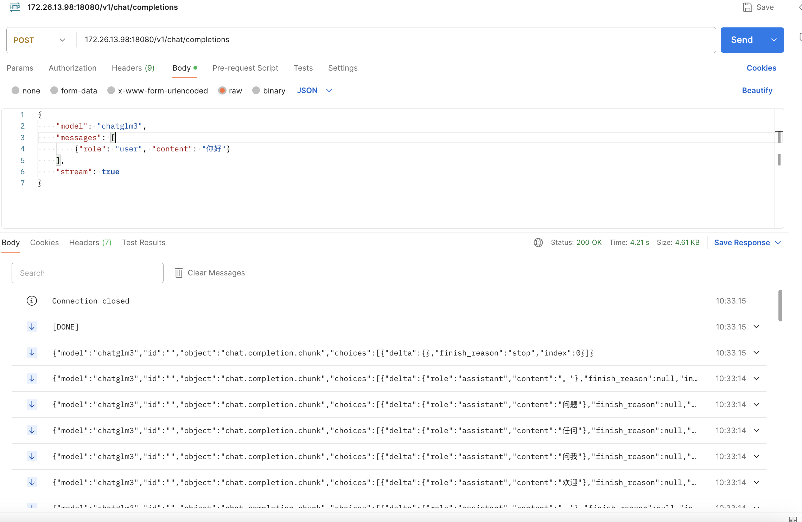

# Python例程

## 目录 
- [1. 环境准备](#1-环境准备)
  - [1.1 x86/arm PCIe平台](#11-x86arm-pcie平台)
  - [1.2 SoC平台](#12-soc平台)
- [2. 启动服务](#2-启动服务)
  - [2.1 参数说明](#21-参数说明)
  - [2.2 使用方式](#32-使用方式)
- [3. 服务调用](#3-服务调用)

python目录下提供了Python例程，具体情况如下：

| 序号  |             Python例程                    |             说明                |
| ---- | ----------------------------------------  | ------------------------------- |
| 1    |    api_server.py                          |         LLM API 服务            |

## 1. 环境准备
### 1.1 x86/arm PCIe平台

如果您在x86/arm平台安装了PCIe加速卡（如SC系列加速卡），并使用它测试本例程，您需要安装libsophon，具体请参考[x86-pcie平台的开发和运行环境搭建](../../../docs/Environment_Install_Guide.md#3-x86-pcie平台的开发和运行环境搭建)或[arm-pcie平台的开发和运行环境搭建](../../../docs/Environment_Install_Guide.md#5-arm-pcie平台的开发和运行环境搭建)。

此外您还需要安装其他第三方库：
```bash
pip3 install -r python/requirements.txt
```

您还需要安装sophon-sail，由于本例程需要的sophon-sail版本较新，相关功能还未发布，这里暂时提供一个可用的sophon-sail源码，x86/arm PCIe环境可以通过下面的命令下载：
```bash
pip3 install dfss --upgrade #安装dfss依赖
python3 -m dfss --url=open@sophgo.com:sophon-demo/Qwen/sophon-sail.tar.gz
tar xvf sophon-sail.tar.gz
```
参考[sophon-sail编译安装指南](https://doc.sophgo.com/sdk-docs/v24.04.01/docs_latest_release/docs/sophon-sail/docs/zh/html/1_build.html#)编译不包含bmcv,sophon-ffmpeg,sophon-opencv的可被Python3接口调用的Wheel文件。

### 1.2 SoC平台

如果您使用SoC平台（如SE、SM系列边缘设备），并使用它测试本例程，刷机后在`/opt/sophon/`下已经预装了相应的libsophon运行库包。

此外您还需要安装其他第三方库：
```bash
pip3 install -r python/requirements.txt
```
由于本例程需要的sophon-sail版本较新，这里提供一个可用的sophon-sail whl包，SoC环境可以通过下面的命令下载：
```bash
pip3 install dfss --upgrade
python3 -m dfss --url=open@sophgo.com:sophon-demo/Qwen/sophon_arm-3.8.0-py3-none-any.whl  #arm soc, py38
```
如果whl包无法使用，也可以参考上一小节，下载源码自己编译。

## 2. 启动服务
python例程不需要编译，可以直接运行，PCIe平台和SoC平台的测试参数和运行方式是相同的。
### 2.1 参数说明
api_server.py使用config.yaml配置文件进行参数配置。

config.yaml内容如下
```yaml
models:  # 模型列表
  - name: qwen   # 模型名称，可选qwen/chatglm3
    bmodel_path: ../models/BM1684X/qwen2-7b_int4_seq512_1dev.bmodel # 模型路径，根据实际情况修改
    token_path: ./utils/qwen/token_config  # tokenizer 路径
    dev_id: 0  # tpu id


port: 18080 # 服务端口
```

### 2.2 使用方式

```bash
cd python
python3 api_server.py --config ./config.yaml
```
## 3. 服务调用
1. 可以使用OpenAI库进行调用
```bash
python3 request.py
```
2. 使用http接口调用

接口url： ip:port/v1/chat/completions
例如： 172.26.13.98:18080/v1/chat/completions

接口参数：
```json
{
    "model": "qwen",
    "messages": [
        {"role": "user", "content": "你好"}
    ],
    "stream": true
}
```
stream为true时为流式推理。

可以使用postman测试接口
