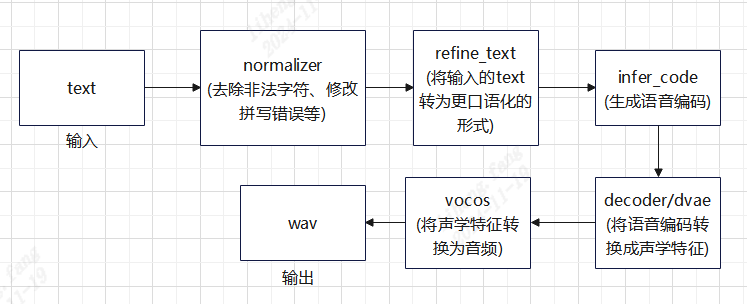

# Python例程

## 目录

- [Python例程](#python例程)
  - [目录](#目录)
  - [1. 环境准备](#1-环境准备)
    - [1.1 x86/arm PCIe平台](#11-x86arm-pcie平台)
    - [1.2 SoC平台](#12-soc平台)
  - [2. 推理测试](#2-推理测试)
  - [3. 程序流程图](#3-程序流程图)

## 1. 环境准备
### 1.1 x86/arm PCIe平台

如果您在x86/arm平台安装了PCIe加速卡（如SC系列加速卡），并使用它测试本例程，您需要安装libsophon、sophon-opencv、sophon-ffmpeg，具体请参考[x86-pcie平台的开发和运行环境搭建](../../../docs/Environment_Install_Guide.md#3-x86-pcie平台的开发和运行环境搭建)或[arm-pcie平台的开发和运行环境搭建](../../../docs/Environment_Install_Guide.md#5-arm-pcie平台的开发和运行环境搭建)。

此外您还需要安装其他第三方库：
```bash
pip3 install -r requirements.txt
```

您还需要安装sophon-sail，由于本例程需要的sophon-sail版本较新，相关功能还未发布，这里暂时提供一个可用的sophon-sail源码，x86/arm PCIe环境可以通过下面的命令下载：
```bash
pip3 install dfss --upgrade #安装dfss依赖
python3 -m dfss --url=open@sophgo.com:sophon-demo/Qwen/sophon-sail.tar.gz
tar xvf sophon-sail.tar.gz
```
参考[sophon-sail编译安装指南](https://doc.sophgo.com/sdk-docs/v24.04.01/docs_latest_release/docs/sophon-sail/docs/zh/html/1_build.html#)编译不包含bmcv,sophon-ffmpeg,sophon-opencv的可被Python3接口调用的Wheel文件。

### 1.2 SoC平台

如果您使用SoC平台（如SE、SM系列边缘设备），并使用它测试本例程，刷机后在`/opt/sophon/`下已经预装了相应的libsophon、sophon-opencv和sophon-ffmpeg运行库包。

此外您还需要安装其他第三方库：
```bash
pip3 install -r requirements.txt
```
由于本例程需要的sophon-sail版本较新，这里提供一个可用的sophon-sail whl包(限BM1688系列设备)，SoC环境可以通过下面的命令下载：
```bash
pip3 install dfss --upgrade
python3 -m dfss --url=open@sophgo.com:sophon-demo/Qwen/sophon_arm-3.8.0-py3-none-any.whl  #arm soc, py38, for se9
```
如果whl包无法使用，也可以参考上一小节，下载源码自己编译。

## 2. 推理测试

`ChatTTS`是封装好的模块，用户可以基于`ChatTTS`模块做二次开发。在调用之前，需要配置好`ChatTTS/config/config.py`里的`class Path`中相关bmodel的路径。

`test.py`是调用示例，可以直接运行`test.py`：
```bash
cd python
python3 test.py
```
运行完成后会在当前目录下生成`test.wav`。

## 3. 程序流程图

