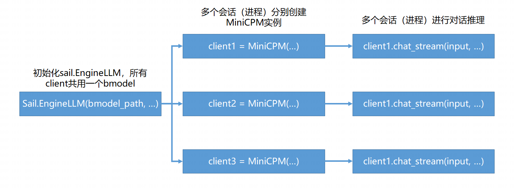
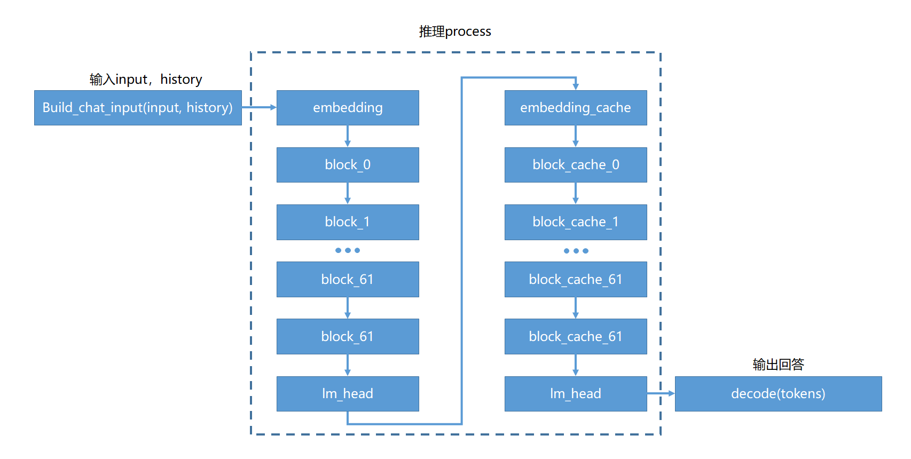
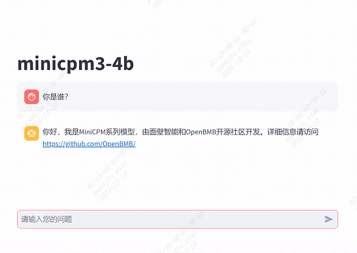

# Python例程

## 目录

* [1. 环境准备](#1-环境准备)
    * [1.1 x86/arm/riscv PCIe平台](#11-x86armriscv-pcie平台)
    * [1.2 SoC平台](#12-soc平台)
* [2. 推理测试](#2-推理测试)
    * [2.1 参数说明](#21-参数说明)
    * [2.2 使用方式](#22-使用方式)
* [3. Web Demo](#3-Web-Demo)
    * [3.1 参数说明](#31-使用方式)
    * [3.2 程序流程图](#32-程序流程图)
    * [3.3 使用方式](#33-使用方式)
* [4. Openai API 接口服务](#4-Openai-API接口服务)
    * [4.1 参数说明](#41-参数说明)
    * [4.2 使用方式](#42-使用方式)
python目录下提供了一系列Python例程，具体情况如下：

| 序号 |  Python例程           | 说明                                  |
| ---- | ---------------------| -----------------------------------  |
| 1    | minicpm3.py          | 使用SAIL推理                          |
| 2    | web_demo.py          | web demo                             |
| 3    | openai_api_server.py | openai api 接口服务                   |

## 1. 环境准备
### 1.1 x86/arm/riscv PCIe平台

如果您在x86/arm/riscv平台安装了PCIe加速卡（如SC系列加速卡），并使用它测试本例程，您需要安装libsophon，但是不需要sophon-opencv、sophon-ffmpeg，具体请参考[x86-pcie平台的开发和运行环境搭建](../../../docs/Environment_Install_Guide.md#3-x86-pcie平台的开发和运行环境搭建)或[arm-pcie平台的开发和运行环境搭建](../../../docs/Environment_Install_Guide.md#5-arm-pcie平台的开发和运行环境搭建)或[riscv-pcie平台的开发和运行环境搭建](../../../docs/Environment_Install_Guide.md#6-riscv-pcie平台的开发和运行环境搭建)。

此外您还需要安装其他第三方库：
```bash
pip3 install -r python/requirements.txt
```


您还需要安装sophon-sail，由于本例程需要的sophon-sail版本较新，相关功能还未发布，这里暂时提供一个可用的sophon-sail源码，x86/arm/riscv PCIe环境可以通过下面的命令下载：
```bash
pip3 install dfss --upgrade #安装dfss依赖
python3 -m dfss --url=open@sophgo.com:sophon-demo/MiniCPM3/sophon-sail.tar.gz
tar xvf sophon-sail.tar.gz
```
参考[sophon-sail编译安装指南](https://doc.sophgo.com/sdk-docs/v24.04.01/docs_latest_release/docs/sophon-sail/docs/zh/html/1_build.html#)编译不包含bmcv,sophon-ffmpeg,sophon-opencv的可被Python3接口调用的Wheel文件。

### 1.2 SoC平台

如果您使用SoC平台（如SE、SM系列边缘设备），并使用它测试本例程，刷机后在`/opt/sophon/`下已经预装了相应的libsophon、sophon-opencv和sophon-ffmpeg运行库包。

此外您还需要安装其他第三方库：
```bash
pip3 install -r python/requirements.txt
```
由于本例程需要的sophon-sail版本较新，这里提供一个可用的sophon-sail whl包，SoC环境可以通过下面的命令下载：
```bash
pip3 install dfss --upgrade
python3 -m dfss --url=open@sophgo.com:sophon-demo/MiniCPM3/sophon_arm-3.9.0-py3-none-any.whl  #arm soc, py38
```
如果whl包无法使用，也可以参考上一小节，下载源码自己编译。
## 2. 推理测试
python例程不需要编译，可以直接运行，PCIe平台和SoC平台的测试参数和运行方式是相同的。
### 2.1 参数说明
minicpm3.py使用config/minicpm3.yaml配置文件进行参数配置。

minicpm3.yaml内容如下
```yaml
bmodel_path: ../models/BM1684X/minicpm3-4b_int4_seq512_1dev.bmodel   ## 用于推理的bmodel路径
token_path: ./token_config    ## tokenizer目录路径；
dev_ids: 0   ## 用于推理的tpu设备id；
```

### 2.2 使用方式

请注意，在进行脚本运行之前请使用 `ulimit -a` 检查您的 `open files` 选项值是否>=65536，可以通过下面的指令来进行设置，如果是PCIE主机可以设置更大，如：1048576
```bash
ulimit -n 65536
```

```bash
cd python
python3 minicpm3.py --config ./config/minicpm3.yaml
```
在读入模型后会显示"Question:"，然后输入就可以了。模型的回答会出现在"Answer"中。结束对话请输入"exit"。


## 3. Web Demo
我们提供了基于[streamlit](https://streamlit.io/)的web demo。
### 3.1 参数说明
web_demo.py使用config/web.yaml配置文件进行参数配置。

web.yaml内容如下
```yaml
title: minicpm3-4b  ## 标题
bmodel_path: ../models/BM1684X/minicpm3-4b_int4_seq512_1dev.bmodel  ## 用于推理的bmodel路径；
token_path: ./token_config   ## tokenizer目录路径；
dev_ids: 0   ## 用于推理的tpu设备id；
```
### 3.2 程序流程图
通过将同一个bmodel传入MiniCPM实例对象中，从而实现多会话同时推理的能力，具体流程如下：


其中chat_stream接收用户输入的问题input，通过sail.EngineLLM进行推理，流式返回生成的文本，具体过程如下：


### 3.3 使用方式
首先安装第三方库
```bash
pip3 install -r python/requirements.txt
```
然后通过streamlit运行web_demo.py即可运行一个web_server

```bash
cd python
python3 -m streamlit run web_demo.py -- --config=./config/web.yaml
```

首次运行需要输入邮箱，您可以选择输入邮箱，也可以直接回车，之后命令行输出以下信息则表示启动成功
```bash
 You can now view your Streamlit app in your browser.

  Network URL: http://172.xx.xx.xx:8501
  External URL: http://103.xx.xxx.xxx:8501
```

在浏览器中打开输出的地址即可使用，web页面如下，在底部对话框中输入问题。


## 4. Openai API接口服务
我们提供了基于openai api 接口server。
### 4.1 参数说明
openai_api_server.py使用config/api.yaml配置文件进行参数配置。

web.yaml内容如下
```yaml
models:                 ## 模型列表
  - name: minicpm3-4b      ## 模型名称，用于匹配模型
    bmodel_path: ../models/BM1684X/minicpm3-4b_int4_seq512_1dev.bmodel ## 用于推理的bmodel路径
    token_path: ./token_config ## tokenizer目录路径
    dev_id: 0  ## 用于推理的tpu设备id

port: 18080   ## 服务端口
```
### 4.2 使用方式
首先安装第三方库
```bash
pip3 install -r python/requirements.txt
```
运行服务
```bash
cd python
python3 openai_api_server.py --config ./config/api.yaml
```

这样我们成功启动了openai api接口服务，可以使用openai的python库进行调用

```bash
python3 openai_api_request.py 
```