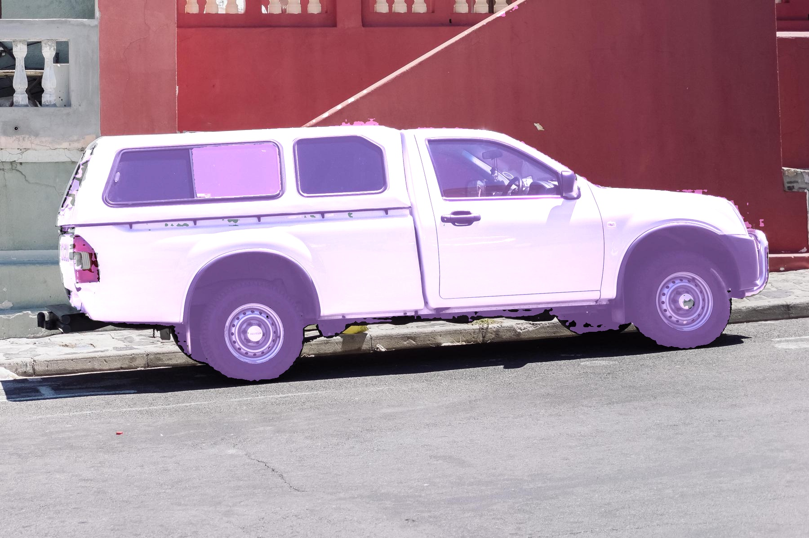
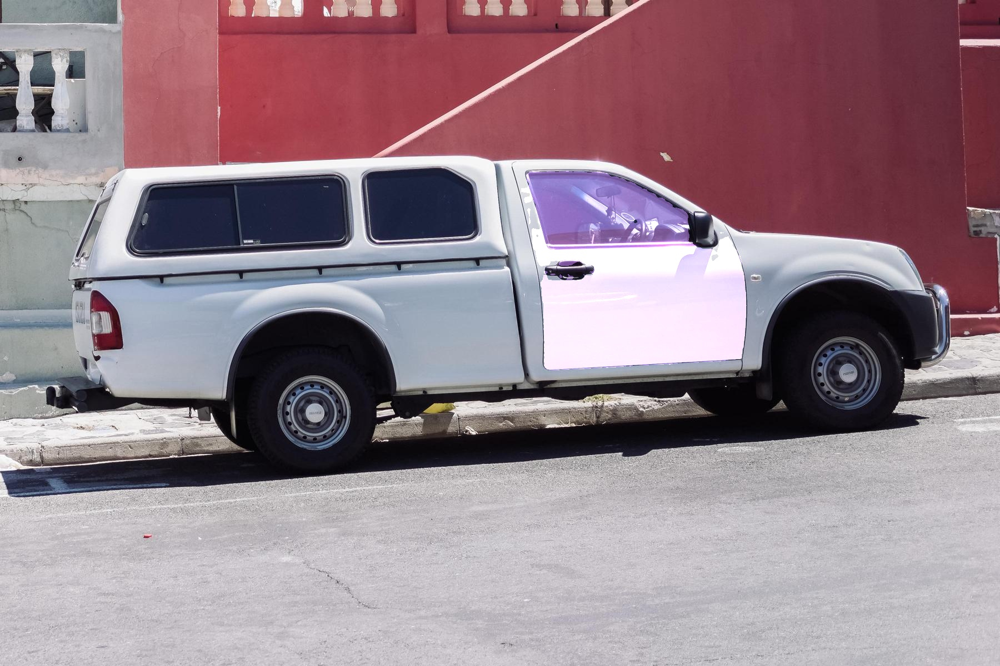
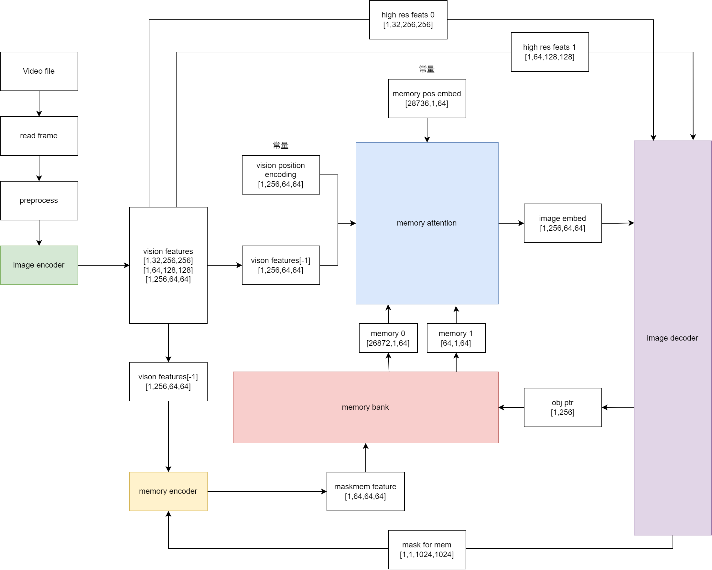

# Python例程

## 目录

- [Python例程](#python例程)
  - [目录](#目录)
  - [1. 环境准备](#1-环境准备)
    - [1.1 SoC平台](#11-SoC平台)
  - [2. 推理测试](#2-推理测试)
    - [2.1 参数说明](#21-参数说明)
    - [2.2 测试图片](#22-测试图片)
      - [2.2.1 单点测试](#221-单点测试)
      - [2.2.1 多点测试](#222-多点测试)
      - [2.2.1 边框测试](#223-边框测试)

python目录下提供了Python例程，具体情况如下：

| 序号 | Python例程     | 说明                                                                |
| ---- | ------------- | ------------------------------------------------------------------ |
| 1    | sam2_image_opencv.py | 图像分割入口程序，使用OpenCV解码、SAIL推理  |
| 2    | sam2_video_opencv.py | 视频分割入口程序，使用OpenCV解码、SAIL推理  |
| 3    | sam2_video_base.py | 视频分割基类，供sam2_video_opencv.py调用 |

## 1. 环境准备

### 1.1 SoC平台

算能的SoC平台（如SE、SM系列边缘设备）在`/opt/sophon/`下已经预装了相应的libsophon、sophon-opencv和sophon-ffmpeg运行库包。但除此之外您还需要交叉编译安装sophon-sail，具体可参考[交叉编译安装sophon-sail](../../../docs/Environment_Install_Guide.md#42-交叉编译安装sophon-sail)。

在运行之前您需要先安装一些Python依赖， 可以通过pip3直接安装
```bash
pip3 install -r requirements.txt
```

## 2. 推理测试
### 2.1 参数说明
sam_image_opencv.py的参数说明如下：
```bash
usage: sam2_image_opencv.py [-h] [--mode MODE] [--img_path IMG_PATH] [--points POINTS] [--label LABEL] [--dataset_type DATASET_TYPE] [--gt_path GT_PATH]
                      [--detect_num DETECT_NUM] [--output_dir OUTPUT_DIR] [--encoder_bmodel ENCODER_BMODEL] [--decoder_bmodel DECODER_BMODEL]
                      [--select_best SELECT_BEST]

optional arguments:
  -h, --help                  show this help message and exit
  --mode                      指定分割模式。可选值为 'img' 或 'dataset'。在 'img' 模式下，需要提供图片路径(img_path)、坐标点 (points) 和标签 (label)；在 'dataset' 模式下，需要提供图片路径 (img_path)、数据集类型 (dataset_type) 和真值路径 (gt_path)。
  --img_path                  输入图片或数据集的路径
  --points                    输入点的坐标。可以是单个点的格式 [[x, y]], 多点的格式[[x1, y1], [x2, y2]] 或者矩形框的格式 [[x1, y1, w, h]]（类似于COCO数据集的边界框格式）
  --label                     输入点的标签
  --dataset_type              数据集类型。目前支持的选项包括 'COCODataset'
  --gt_path                   真值文件的路径
  --detect_num                在数据集模式下，用于分割的图像数量
  --output_dir                用于保存模型输出结果的目录
  --encoder_bmodel            编码器模型文件的路径
  --decoder_bmodel            解码器模型文件的路径
  --select_best               是否选择最佳掩模进行分割
```
sam2_video_open.py的参数说明如下：
```bash
用法: sam2_video_opencv.py [-h] [--video_path VIDEO_PATH] [--points POINTS] [--label LABEL] [--output_dir OUTPUT_DIR]
                            [--image_encoder_path IMAGE_ENCODER_PATH] [--image_decoder_path IMAGE_DECODER_PATH]
                            [--memory_attention_path MEMORY_ATTENTION_PATH] [--memory_encoder_path MEMORY_ENCODER_PATH]
                            [--constant_path CONSTANT_PATH] [--dev_id DEV_ID]

可选参数:
  -h, --help            显示此帮助信息并退出
  --video_path VIDEO_PATH
                        输入视频或数据集的路径
  --points POINTS       输入点的坐标，格式为"[[x,y]]"
  --label LABEL         输入点的标签
  --output_dir OUTPUT_DIR
                        用于保存模型的输出结果
  --image_encoder_path IMAGE_ENCODER_PATH
                        sam2 image encoder bmodel的路径
  --image_decoder_path IMAGE_DECODER_PATH
                        sam2 image decoder bmodel的路径
  --memory_attention_path MEMORY_ATTENTION_PATH
                        sam2 memory attention bmodel的路径
  --memory_encoder_path MEMORY_ENCODER_PATH
                        sam2 memory encoder bmodel的路径
  --skip_num            SKIP_NUM
                        每隔几帧抽一帧
  --constant_path CONSTANT_PATH
                        常量npz文件的路径
  --dev_id DEV_ID       TPU设备ID

```

### 2.2 测试图片

#### 2.2.1 单点测试 
运行sam2_image_opencv.py进行例程测试，此处以`datasets/truck.jpg`为例进行测试，输入一个point坐标，并指定其标签

原始图像：

<div style="text-align: center;">
  
</div>

```bash
python3 python/sam2_image_opencv.py --img_path datasets/images/truck.jpg --points '[[500, 375]]' --label 1 --encoder_bmodel models/bmodel/image/BM1688/image_encoder/sam2_encoder_f16_1b_2core.bmodel --decoder_bmodel models/bmodel/image/BM1688/image_decoder/sam2_decoder_f16_1b_2core.bmodel
```
输出结果为：
<div style="text-align: center;">
  
</div>

#### 2.2.2 多点测试 
输入两个个point坐标，并指定其标签
```bash
python3 python/sam2_image_opencv.py --img_path datasets/images/truck.jpg --points '[[500, 375], [345, 300]]' --label 1 --encoder_bmodel models/bmodel/image/BM1688/image_encoder/sam2_encoder_f16_1b_2core.bmodel --decoder_bmodel models/bmodel/image/BM1688/image_decoder/sam2_decoder_f16_1b_2core.bmodel
```

输出结果为：
<div style="text-align: center;">
  
</div>

#### 2.2.3 边框测试 

输入一个框，并指定其标签
```bash
python3 python/sam2_image_opencv.py --img_path datasets/images/truck.jpg --points '[[900, 300, 350, 350]]' --label 1 --encoder_bmodel models/bmodel/image/BM1688/image_encoder/sam2_encoder_f16_1b_2core.bmodel --decoder_bmodel models/bmodel/image/BM1688/image_decoder/sam2_decoder_f16_1b_2core.bmodel
```

输出结果为：
<div style="text-align: center;">
  
</div>

## 2.3 视频测试
本测试与官方demo中测试的视频一致，为保存在文件夹中的视频帧，不过本demo同时也支持mp4和avi格式的视频分割，运行视频分割的demo，可直接通过运行sam2_video_opencv.py完成
```bash
python3 python/sam2_video_opencv.py
```
输出结果为：

<div style="text-align: center;">
  
</div>

<div style="text-align: center;">
  
</div>

<div style="text-align: center;">
  
</div>

图片分别为视频的第1帧，第25帧和第30帧

## 流程图

sam2_image_opencv中的处理流程，遵循以下流程图：
<div style="text-align: center;">
  
</div>

sam2_video_opencv中的处理流程，遵循以下流程图：
<div style="text-align: center;">
  
</div>