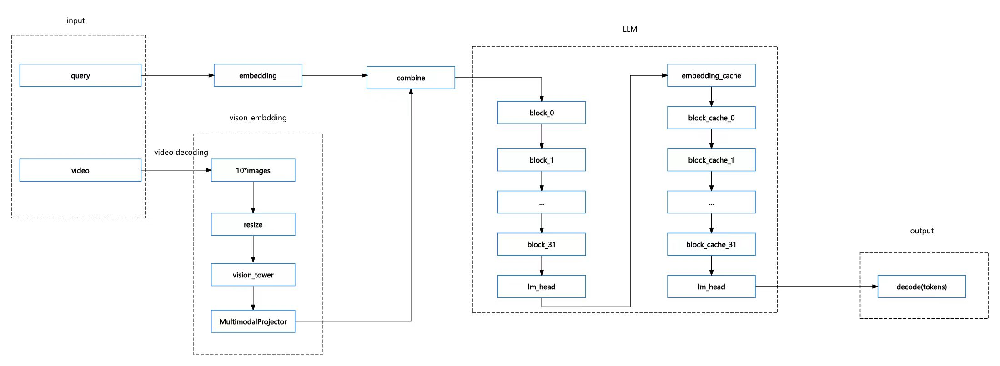

# Python例程

## 目录

* [1. 环境准备](#1-环境准备)
    * [1.1 x86/arm PCIe平台](#11-x86arm-pcie平台)
    * [1.2 SoC平台](#12-soc平台)
* [2. 推理测试](#2-推理测试)
    * [2.1 流程图](#21-流程图)
    * [2.2 使用方式](#22-使用方式)

python目录下提供了一系列Python例程，具体情况如下：

| 序号 |  Python例程           | 说明                                  |
| ---- | ---------------------| -----------------------------------  |
| 1    | vila.py              | 使用SAIL推理                          |


## 1. 环境准备
### 1.1 x86/arm PCIe平台

如果您在x86/arm平台安装了PCIe加速卡（如SC系列加速卡），并使用它测试本例程，您需要安装libsophon、sophon-opencv、sophon-ffmpeg，具体请参考[x86-pcie平台的开发和运行环境搭建](../../../docs/Environment_Install_Guide.md#3-x86-pcie平台的开发和运行环境搭建)或[arm-pcie平台的开发和运行环境搭建](../../../docs/Environment_Install_Guide.md#5-arm-pcie平台的开发和运行环境搭建)。

此外您还需要安装其他第三方库：
```bash
pip3 install -r python/requirements.txt
```

运行单芯模型使用v24.04.01驱动版本

您还需要安装sophon-sail，由于本例程需要的sophon-sail版本较新，相关功能还未发布，这里暂时提供一个可用的sophon-sail源码，x86/arm PCIe环境可以通过下面的命令下载：
```bash
pip3 install dfss --upgrade #安装dfss依赖
python3 -m dfss --url=open@sophgo.com:sophon-demo/Qwen/sophon-sail.tar.gz
tar xvf sophon-sail.tar.gz
```
参考[sophon-sail编译安装指南](https://doc.sophgo.com/sdk-docs/v24.04.01/docs_latest_release/docs/sophon-sail/docs/zh/html/1_build.html#)编译不包含bmcv,sophon-ffmpeg,sophon-opencv的可被Python3接口调用的Wheel文件。

### 1.2 SoC平台

如果您使用SoC平台（如SE、SM系列边缘设备），并使用它测试本例程，刷机后在`/opt/sophon/`下已经预装了相应的libsophon、sophon-opencv和sophon-ffmpeg运行库包。

此外您还需要安装其他第三方库：
```bash
pip3 install -r python/requirements.txt
```
由于本例程需要的sophon-sail版本较新，这里提供一个可用的sophon-sail whl包，SoC环境可以通过下面的命令下载

对于BM1684X:
```bash
pip3 install dfss --upgrade
python3 -m dfss --url=open@sophgo.com:sophon-demo/Qwen/sophon_arm-3.8.0-py3-none-any.whl  #arm soc, py38
```
对于BM1688：
```bash
pip3 install dfss --upgrade
python3 -m dfss --url=open@sophgo.com:sophon-demo/vila/sophon_arm-3.9.0-py3-none-any.whl
```

如果whl包无法使用，也可以参考上一小节，下载源码自己编译。

> **注:**
>
> 上述命令安装的opencv是公版opencv，如果您希望使用sophon-opencv，可以设置如下环境变量：
> ```bash
> export PYTHONPATH=$PYTHONPATH:/opt/sophon/sophon-opencv-latest/opencv-python/
> ```
> **若使用sophon-opencv需要保证python版本小于等于3.8。**

## 2. 推理测试
python例程不需要编译，可以直接运行，PCIe平台和SoC平台的测试参数和运行方式是相同的。

### 2.1 流程图
vila1.5模型有vision_embedding和LLM模块，其中vision_embedding模块负责将图片转化为向量再和LLM生成的词向量combine起来，最终由LLM模块输出回答。


### 2.1 参数说明
```bash
usage: vila.py [--llm LLM_BMODEL] [--vision VISION_BMODEL] [--video VIDEO] [--dev_id DEV_ID]
--llm: 用于推理的llm bmodel路径；
--vision: 用于推理的vision_embedding bmodel路径；
--video: 视频路径
--dev_id: 用于推理的tpu设备id；
```
### 2.2 使用方式
必须在Vila目录下执行程序
```bash
python3 python/vila.py --llm ./models/BM1684X/llama_int4_seq2560.bmodel --vision ./models/BM1684X/vision_embedding_6batch.bmodel --video datasets/test_car_person_1080P.mp4 --dev_id 0
```
在Question for this video: 处进行提问，例如：Please describe this video。

